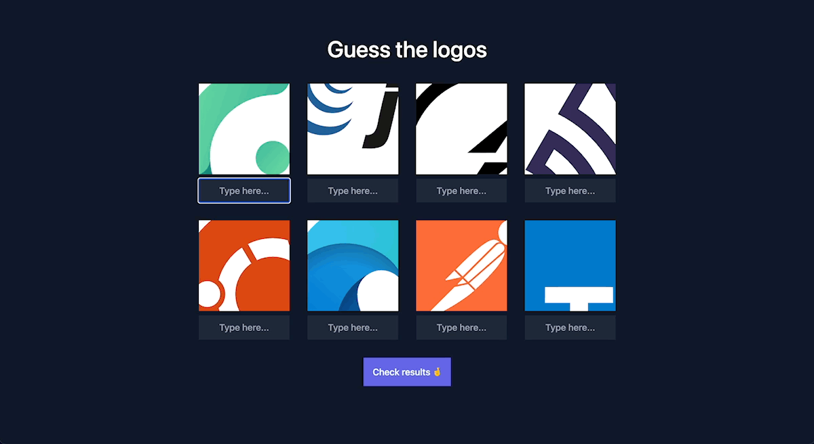

# Challenge

Dans cet exercice pratique, vous allez créer un jeu de quiz avec JavaScript, HTML CSS et Node.js. Le joueur devra deviner le nom de la technologie web qui se cache derrière chaque logo. Pour corser la partie, les logos ne seront que partiellement visible.



## Démarrage

### Installation

Tout d'abord, assurez-vous d'avoir la version [Node.js v16+](https://nodejs.org/) installée.

Puis exécutez la commande suivante pour installer les dépendances du projet :

```sh
npm install
```

### Démarrer le serveur de développement

Exécutez la commande suivante pour démarrer l'application :

```sh
npm run start
```

Alternativement, il est possible de démarrer le serveur en mode _watch_. Cette commande permet de relancer le serveur dès qu'un fichier est modifié :

```
npm run watch
```

Après l'exécution d'une de ces commandes, l'application sera disponible à l'adresse http://localhost:3000.

### Exécuter les tests

Ce projet utilise [Cypress](https://www.cypress.io/) afin de tester l'application. Une fois que votre serveur est lancé, vous pouvez exécuter l'un des scripts ci-dessous pour lancer les tests.

Cette commande démarre l’interface d’exécution de tests de Cypress ([Test Runner](https://docs.cypress.io/guides/core-concepts/test-runner)) dans votre navigateur :

```sh
npm run cypress:open
```

Pour lancer les tests en mode _headless_ (sans ouvrir le navigateur), utilisez la commande suivante :

```sh
npm run cypress:run

# ou en forçant un navigateur spécifique
npm run cypress:run -- --browser chrome
```

Il est recommandé  de développer et tester votre application avec Chrome ou Chromium afin d'assurer les mêmes conditions que lors de la correction de votre travail.

Référez-vous au fichier [FAQ.md](./FAQ.md) pour quelques informations complémentaires sur le projet.

## Cahier des charges

Le but de ce challenge est d'apporter les modifications nécessaires au projet de base fourni afin qu'il fonctionne tels que dans la [démo](./demo.gif).

Vous trouverez ci-dessous la liste des modifications à faire ainsi que les critères d'évaluation. La plupart de critères sont validés par les tests Cypress : [cypress/integration/game.spec.js](./cypress/integration/game.spec.js)

1. La page affiche 8 logos choisis aléatoirement parmi les 124 logos disponibles dans le fichier `images.json`. (4 pt)
2. Ajoutez un champ texte en dessous de chaque logo afin de permettre au joueur d'entrer ses réponses. (1 pt)
3. Ajoutez un bouton "Check results" permettant de vérifier les réponses du quiz. (1 pt)
4. Écrivez un script JavaScript qui envoie les réponses au serveur avec une requête POST à l'endpoint `/verify` lorsque le joueur clique sur le bouton "Check results". Le body de la requête est un objet dont les clés correspondent aux ids des logos et les valeurs aux réponses de l'utilisateur. (3 pt)
   ```js
   // Exemple
   {
      "angular-icon": "Angular",
      "nextjs": "Nuxt",
      ...
   }
   ```
5. À l'endpoint `/verify`, le serveur vérifie les réponses de l'utilisateur en les comparant aux titres des logos. Ensuite, il retourne les solutions du quiz en indiquant les réponses valides. (3 pt)
   ```js
   // Exemple
   [
      { "id": "angular-icon", "title": "Angular", "valid": true },
      { "id": "nextjs", "title": "Next.js", "valid": false }
      ...
   ]
   ```
6. Lorsque le serveur vérifie les réponses de l'utilisateur, la casse et les caractères spéciaux sont ignorés. Par exemple, les valeurs `nextjs` et `Next.js` sont considérées comme étant équivalentes. (2 pt)
7. Une fois les résultats récupérés côté client, écrivez un script qui apporte les modifications suivantes au DOM :
   - Afficher le score du joueur dans la page. Par exemple, `5/8 points`. (1 pt)
   - Remplacer la valeur des champs de texte par la solution. (1 pt)
   - Modifier la couleur des champs de texte en affichant les réponses correctes en vert (`#34d399`) et les réponses fausses en rouge (`#f87171`). (1 pt)
   - Modifier les images afin d'afficher les logos en entier. Les logos entiers se trouvent dans le dossier `public/images/full/`. (1 pt)
8. Ajouter le CSS nécessaire pour que l'interface ressemble au plus proche possible à la démo. (1 pt)
9. Le code que vous rendez est propre, correctement formaté et la commande `npm run lint` ne retourne pas d'erreurs. (1 pt)

Vous êtes libre d'utiliser n'importe quelle technologie Open Source et d'adapter la structure du projet comme bon vous semble.
